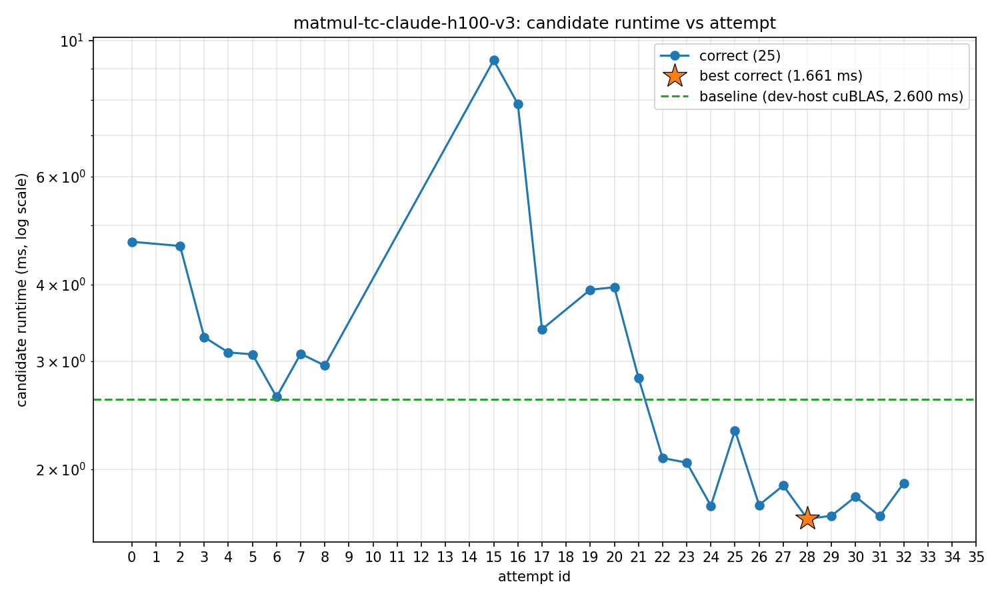

# FINAL REPORT - 13 Tensor Core Matmul — run summary

FP32 GEMM `C = A·B`, column-major, `m=10240 k=4096 n=8192`. Reference is cuBLAS
GemmEx (`CUBLAS_COMPUTE_32F_FAST_16F`, `CUBLAS_GEMM_DEFAULT_TENSOR_OP`).
Correctness tolerance: mean-abs-error < 1e-2. Self-set bar to beat: **~600
TFLOPS / 1.145 ms** (≈60% of H100's 989 TFLOPS dense FP16/FP32-accum peak).

## Result

The final kernel is shipped as [`13_tensorcore.cu`](13_tensorcore.cu),
measured on a single H100:

| | candidate | cuBLAS | margin |
|---|---:|---:|---:|
| runtime | 1.197 ms | 1.933 ms | **candidate 1.62× cuBLAS** |
| GFLOPS | 574,079 | 355,508 | — |
| % of H100 peak (989 TFLOPS) | **58%** | 36% | — |

The kernel reaches `wgmma.mma_async`, the Hopper warp-group MMA path. At
58% of H100 peak it is within ~4.5% of the self-set 600 TFLOPS / 1.145 ms
target.

## Run

| | |
|---|---|
| Model | `claude-opus-4-8` (max reasoning) |
| Wall-clock | 180 min |
| Cost | ~$86 (Opus API price) |
| Attempts | 36 total: 25 correct, 11 failed to build or run |
| Profile runs | 8 |

## Trajectory

Per-attempt milestones. Speedup is against the dev-host cuBLAS reference
(~2.60 ms on this shape, dispatching the older `mma.sync` path):

| id | runtime | GF/s | speedup vs dev-host cuBLAS | move |
|---:|--------:|------:|--------:|------|
| 0 | 4.70 ms | 146k | 0.56× | starter scaffold (`nvcuda::wmma`) |
| 3 | 3.28 ms | 209k | 0.79× | **early tile + swizzle** ✓ |
| 6 | 2.62 ms | 262k | 0.99× | **explicit `mma.sync.m16n8k16` + `cp.async` pipeline** ✓ — matches cuBLAS |
| 13–14, 18 | — | — | — | first `wgmma` bring-up attempts: mean-abs-error ~11–16 ✗ |
| **22** | **2.09 ms** | **329k** | **1.25×** | **first working `wgmma.mma_async.m64n64k16`** ✓ ★ FIRST cuBLAS BEAT |
| 24 | 1.74 ms | 394k | 1.48× | **`WGCNT=2` warpgroups (BM=128)** ✓ |
| **28** | **1.66 ms** | **414k** | **1.56×** | **`wgmma.mma_async.m64n128k16` + `NSTAGE=4`** ✓ ★ final best |
| 31 | 1.68 ms | 410k | 1.56× | confirmation |
| 33, 35 | — | — | — | regression branch: same ~11.6 mae as earlier `wgmma` bring-up, reverted ✗ |

(Runtimes in this table are dev-host measurements; the 1.197 ms / 574k GF
headline in the Result section is the test-host re-benchmark of the same
final kernel.)

## Final kernel

Key design points of [`13_tensorcore.cu`](13_tensorcore.cu):

- `wgmma.mma_async.sync.aligned.m64n128k16.f32.f16.f16` — Hopper warp-group MMA
- `BM=128 BN=256 BK=64`, `WGCNT=2` warpgroups along M, `NMMA=2` wgmma per warpgroup
- 4-stage `cp.async` software pipeline (`NSTAGE=4`)
- Padded shared memory with per-stage A and B swizzle tiles
- Build: `nvcc -O3 -std=c++17 --use_fast_math -arch=sm_90a -lcublas`

The agent climbed the Hopper instruction ladder:
`nvcuda::wmma` → `mma.sync.m16n8k16` → `wgmma.mma_async`. Still missing
relative to a maxed-out Hopper matmul: TMA
(`cp.async.bulk.tensor` + `cuTensorMapEncodeTiled`), thread-block clusters
/ DSMEM, `mbarrier`-coordinated warp specialization, and stream-K /
persistent launches. Those are likely where the next 20–30 percentage
points of peak live.

## Didn't work (measured + rejected)

- Early `wgmma` bring-up: mean-abs-error ~11–16, indicating wrong fragment
  layout or shared-memory descriptor encoding. Eventually fixed.
- Attempts to call cuBLAS from inside the candidate kernel: rejected —
  calling the reference library inside the candidate is not allowed.
- Smaller tiles / higher occupancy: correct but 9–90× slower than the
  current best.
- A late-run `wgmma` rework re-introduced the same fragment-layout bug
  from earlier bring-up (same ~11.6 mean-abs-error signature). Did not
  count toward best.
